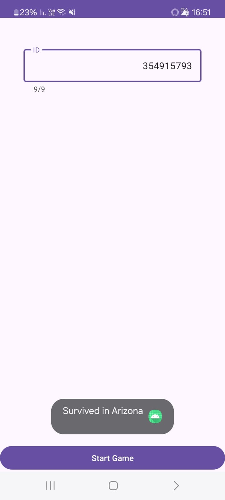

# Survive Game - Reverse Engineering Project

## 💡 Goal

The purpose of this assignment was to perform reverse engineering on an APK file using the techniques learned in class. We were required to extract code and resources, rebuild the application, fix potential bugs, and make the game fully functional.

## 📱 Game Description

The game is a survival-based directional puzzle.  
You start by entering a 9-digit ID number. Based on this ID, you will receive a unique sequence of directions to follow in order to navigate a hidden map and reach your destination city.

## ✅ Submission Checklist

- [x] Extracted code and assets from the APK
- [x] Analyzed and fixed hidden bugs
- [x] Rebuilt a working version of the game
- [x] Reached the final toast message with a city name
- [x] This Git repository contains all the modified code
- [x] README includes detailed explanation of bugs and solutions

## 🔍 Bugs Identified and Solved

### 1. **ID Input Validation**
- **Problem:** No validation for incorrect ID lengths.
- **Fix:**
  - If the user enters 8 digits, a toast is shown:
    `"Your ID must be 9 digits. Please add a leading zero if needed."`
  - If the ID is shorter than 8 or longer than 9, another toast is shown:
    `"Please enter a valid ID"`

### 2. **URL Handling**
- **Fix:** The game fetches a CSV file from a server.
  The URL was moved to `res/values/strings.xml` for easier access and modification.

### 3. **Logging**
- **Fix:** Added logging to assist with debugging server responses and game state.

## 🛠️ AndroidManifest.xml Modifications

The original APK had outdated or unnecessary attributes. The following changes were made:

- Removed unused attributes like `compileSdkVersion`, `platformBuildVersionCode`, etc.
- Updated SDK versions and tools as needed.
- **Added `android:exported="true"`** to activities to comply with Android 12+ requirements. This is required for activities that have an intent filter (like the launcher activity).
- Cleaned and modernized the manifest while keeping the app fully functional.

## 🎮 How to Play

1. Open the app and enter a valid 9-digit ID number.
2. The game will make a server call using the 8th digit of your ID to determine the target city.
3. Once the game starts, your ID will be translated into a sequence of 9 movement directions:
   - Each digit is converted using `digit % 4`:
     - 0 → LEFT
     - 1 → RIGHT
     - 2 → UP
     - 3 → DOWN
4. You must follow the 9 directions in order to reach the correct path.
5. If all steps are correct, you’ll receive a toast message with the name of the city you reached (your goal).
6. Making an incorrect move will cause the game to fail, and you’ll need to try again.

Note: Only 9-digit IDs are accepted. IDs with 8 digits will prompt a message asking you to add a leading zero.

## 🏁 Game Success

After entering a valid 9-digit ID and following the game's instructions, I reached the final toast message with the name of the city.

**🖼️ Screenshot:**

## 🙌 Conclusion

This project was an interesting challenge in reverse engineering, debugging, and rebuilding Android apps. It required understanding both Java and Android internals, identifying hidden bugs, and thinking "outside the box" as instructed.

## 📩 Contact

If you have any questions, suggestions, or want to contribute, feel free to reach out.

## 📧 Email  
📌 [avichai.shchori@gmail.com](mailto:avichai.shchori@gmail.com)  

## 💼 LinkedIn  
📌 [LinkedIn Profile](https://www.linkedin.com/in/avichai-shchori-995832277)
